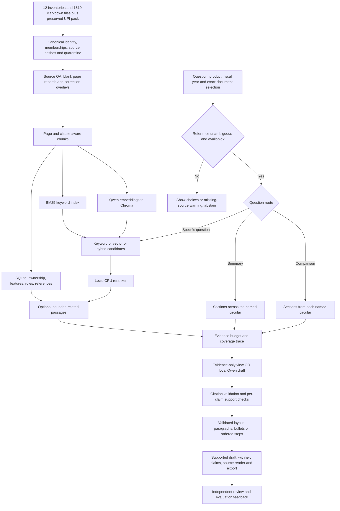

# Payments Guidelines Query Expert flow

The capstone focuses on evidence-grounded payments research. NPCI is the initial corpus; cross-functional feature orchestration is a separate experiment outside this submission.

The central design decision is to preserve document identity while retrieving across related documents. Metadata, semantic similarity and model interpretation have different jobs: none alone establishes legal applicability.

## Current research implementation

Current product scope and future priorities: [midterm scope](output/midsem/CURRENT_SCOPE.md).

Scope refreshed 4 October 2026; underlying RAG implementation v0.5.1. This is a local research prototype for an AI capstone. It retrieves evidence from an imported NPCI circular collection; it does not train Qwen on those documents.

## At a glance

1,562 searchable documents -> 4,826 page records -> 14,060 attributed chunks. The register contains 1,921 canonical records, including 359 unavailable or quarantined entries. All 1,955 supplied inventory listings are preserved. A circular can belong to more than one product; its pages and chunks still keep one canonical owner. New original PDFs are external links, not local files.

## 1. Import and review

The active app reads `data/all-products-v1/index.json` and `data/all-products-v1/all_circular_pages.jsonl`, selected by `config.json`. The importer preserves raw Markdown and inventories under that dataset’s `sources/` folder with checksums. Same-source listings are joined into canonical records and product memberships; different URLs are not merged only because text matches. Existing reviewed UPI text wins on overlaps. Two known title/body conflicts are quarantined. Import commands and rollback are in `docs/MULTI_PRODUCT_IMPORT.md`.

The incoming inventories span archive years 2009–2026 and were generated 9–15 September 2026; retained UPI material extends through 22 September. This was not a live website reconciliation. New issue dates remain unknown, even when the inventory supplies a fiscal year. Blank extracted pages remain visible and are never embedded.

Raw extraction is preserved. `data/all-products-v1/review_annotations.json` holds source-hash-bound corrections, reviewed dates, feature/participant labels and circular relationships. Only accepted records affect a rebuilt index. Proposed and rejected records stay in the audit trail. A changed source hash or a conflicting accepted correction stops application rather than silently editing a different passage.

The Source review screen flags currency symbols, OCR numbers, tables and original priority pages. These flags are candidates for review, not confirmed errors. The initial pass contains 10 assistant-source-checked annotations: five currency corrections on three PDF pages, one issue-date check, three feature/role mappings and one reference check. It is not a full-corpus human review.

## 2. How chunking works

1. Work within one circular, then one page, in source order.
2. Recognize headings and numbered or lettered clauses at line starts.
3. Keep a heading with the first clause; start subsequent clauses separately.
4. Split long blocks at 220 words, with 35 words of overlap. Short clauses have no automatic overlap.
5. Store page-local, zero-based, end-exclusive word offsets, a section ID and previous/next chunk links. Links never cross circular boundaries.
6. Add source ownership, feature hints, participant cues and review provenance.

Offsets refer to the effective text after accepted overlays. Original text remains visible beside the corrections in the source reader. Tables are not structurally reconstructed and semantic models do not choose chunk boundaries.

## 3. Storage and models

| Component | Job |
|---|---|
| BM25, in memory | Match exact words and circular numbers. |
| qwen3-embedding:0.6b, Ollama | Produce 1024-dimensional vectors for passages/questions. |
| Chroma, on disk | Store vectors and retrieve similar passages with document filters. |
| SQLite, on disk | Preserve documents, chunks, features and reference relationships. |
| MiniLM cross-encoder, quantized ONNX | Score query-passage pairs locally on CPU; up to 32 candidates. |
| qwen3.5:9b, Ollama | Generate a cited draft, then assess individual claims against cited evidence. |

The reranker is pinned to `Xenova/ms-marco-MiniLM-L-6-v2` revision `a09144355adeed5f58c8ed011d209bf8ee5a1fec`. Its files are hash-checked. Runtime ranking does not download anything. A ranking score is not a confidence percentage.

## 4. Question-dependent retrieval

**Specific question:** exact circular/product/date/feature filters -> up to 32 candidates -> optional reranking -> up to eight direct seeds. Hybrid uses reciprocal-rank fusion of BM25 and vector ranks. Related scope may add two referenced documents, one same-feature passage and six same-section neighbours, with a maximum of 18 passages. Direct scope excludes expansion.

**Summary:** select an exact circular in the Library and click **Summarise this circular**, or give a unique reference such as `Summarise UPI OC 186A`. The app samples across all its sections, rather than selecting only a few similar passages. It records included/total chunk counts. A small document may fit completely; larger ones may be partial.

**Comparison:** use **Add to comparison** in each reader, or name unambiguous references such as `Compare UPI OC 186 and OC 186A`. Repeated numbers across products/years require a product/fiscal year or exact selection. Sections are selected round-robin across the documents so each side is represented. A missing, ambiguous or filtered-out requested circular causes the comparison to be withheld. It does not silently compare only the available side.

Summary and comparison routes bypass passage reranking because breadth is the objective. Both have a 48-passage ceiling and share the 18,000-character evidence budget. Budget omissions are exposed. Coverage is also partial/unverified if source pages are blank or the original PDF page count is unknown, even when every available chunk fits. Complete input coverage does not guarantee a complete generated answer. English keyword routing can be overridden in the Question type control.

## 5. Related circulars remain distinct

A citation always belongs to one circular and page. A reference edge can connect OC 186A to OC 186 without merging their text or asserting supersession. 18 product-scoped feature rules use title and clause patterns, with accepted clause-level overrides. Most new cross-product reference relationships still need source review; matching numbers do not create edges. Participant labels use explicit text cues; most labels remain unreviewed heuristics. Reviewed labels show their reviewer type.

The document feature filter uses the union of its labels. A reviewed clause does not certify the rest of its document. Reviewed relationships can be recorded as references, clarifies, amends or supersedes, but this is an annotation workflow, not automatic legal interpretation.

## 6. Draft and claim checks

Evidence-only mode stops before generation. AI draft mode sends selected excerpts, metadata and coverage notes to local Qwen. Output must be structured claims with valid source IDs.

For each claim, deterministic guards check numbers against the cited text/metadata. The local model then classifies support as supported, unsupported or uncertain and supplies quotations. Quotations must match the cited passage after whitespace and typographic punctuation normalization; OCR spelling and numbers are not silently corrected. Invalid quotations, malformed responses and unavailable checks cause claims to be withheld. Only claims passing these checks appear in the supported draft. Withheld claims remain separately inspectable and labelled in exports.

This is a useful filter, not independent verification: generation and checking use the same model and share its blind spots. A human must check important claims and omissions. The check does not determine present-day applicability.

## 7. Answer presentation

The model proposes a layout separately from its factual claims. Short answers and explanations can be prose, parallel requirements can be bullets, and a summary can mix paragraphs and lists. A supported sequence can use numbered steps. Every block references existing claims; it cannot add unchecked text. Withheld claims disappear before the layout is rendered, and invalid layouts fall back without losing supported claims. Citations stay beside each statement.

Leave Answer style set to Automatic, or choose Paragraphs, Bullet points or Paragraphs + bullets. The same structure is preserved in exported notes. No second model rewrite or embedding rebuild is needed. See [formatting design and checks](docs/ANSWER_FORMATTING.md).

## 8. Evaluation and limits

The frozen 50-question set has 32 clause questions, six summaries, six comparisons and six negative cases. Each positive case has a proposed answer and source-page anchors. All remain AI-assisted drafts awaiting independent review. The 32 development / 18 reserved-review split is not an independently authored held-out test.

`run.cmd validate` checks source hashes, SQLite integrity, 12 product filters, ambiguity/coverage handling and the frozen 50 UPI cases. With an explicit UPI filter in the expanded corpus, BM25 and hybrid each retain all 55 anchors. `run.cmd live-check` exercises seven product-specific generation cases plus two abstention cases. 103 automated tests pass including the formatting extension. Anchor recall measures whether expected phrases were retrieved, not answer correctness. See `docs/VALIDATION_V05.md` and `evaluation/independent_review.csv` for evidence and human-review work.

Generation context remains 16,384 tokens, with up to 3,072 output tokens. Evidence is capped at 18,000 characters; characters are not tokens. Longer responses and per-claim checking take longer. The collection is a historical snapshot, OCR errors remain, and issue-date filtering does not reconstruct effective rules.

## Run the project

Open Ollama. Double-click `run.cmd` in the project folder and keep its window open. Visit http://127.0.0.1:8765. In PowerShell, use `.\run.cmd`; it avoids the script execution-policy error from `run.ps1`.

After accepting source reviews: stop the app, run `.\run.cmd embed`, then `.\run.cmd`. The application uses immutable fingerprinted snapshots and refuses a stale vector index. No rebuild is needed just to adjust context/output limits.

For colleagues: share this updated flow, `docs/VALIDATION_V05.md` and the beginner guide. Current screenshots are in `docs/screenshots/v05-*.png`. The existing v0.4 PDF is historical and does not describe the expanded corpus. Do not send `.venv` or the vector database as reading material.

A reusable SQLite embedding cache records exact text/model hashes. Rebuilds reuse unchanged vectors, then publish a complete Chroma snapshot. The initial expanded build took about 15.4 minutes; ordinary questions do not re-embed the corpus.

## What the preliminary experiment shows

The same-snapshot comparison recovered 55/55 proposed source anchors in all four variants. It showed no anchor-recall gain from reranking on the current reference-heavy set. Semantic methods returned evidence for one unrelated question. These observations motivate independent review, harder negatives and paraphrases. They do not establish general answer accuracy. See [mid-sem validation](docs/MIDSEM_VALIDATION.md).
