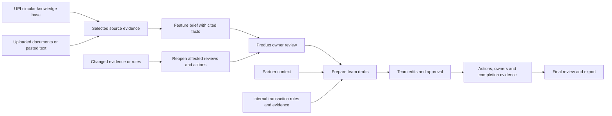

# UPI Feature Workspace — V2

**A local internal tool for turning UPI feature evidence into coordinated team work.**

The workspace supports three purposes: reviewing an **existing feature**, coordinating a **feature change**, or preparing a **new launch**. It gives the product owner and Customer Success, Marketing, BD and Transaction Risk teams a shared understanding, reviewed outputs and a record of follow-through.

## The product flow

1. **Sources:** Choose relevant passages from the existing UPI circular collection, upload documents, or paste source text. Uploaded text is previewed before it becomes workspace evidence.
2. **Feature brief:** Local AI drafts facts with source references. The application copies the original source quotations. The product owner checks meaning and applicability, resolves questions and approves the brief.
3. **Team work:** Prepare one team draft or queue all four. Review recommendations alongside their supporting evidence. Each team can edit its draft and record approval or request changes.
4. **Actions & review:** Record task ownership, prerequisites and completion evidence. When required reviews and actions are complete, record the final decision and export the review pack.

The overview recommends the next action from the workspace's actual state. Navigation follows the work order. Validation errors appear inside the relevant form, and unsaved edits remain available for correction.

## What each team receives

| Team | Purpose |
|---|---|
| Customer Success | Feature explanations, support guidance, unresolved-case handling and escalation questions. |
| Marketing | Communication impact, supported claims, proposed copy and branding/content review actions. An existing-feature review does not automatically imply a new campaign. |
| Partners & BD | Supplied participant context, impact, required follow-up, adoption/readiness questions and dependencies. |
| Transaction Risk | Assessment of UPI-side transaction rules: applicability, existing documented coverage, evidence gaps and proposed changes. |

## Transaction Risk

A rule record captures **name, applicability, transaction condition, action, owner, reported status and source evidence**. Actions include monitoring, declining, step-up verification, review and rate limiting. Status can be proposed, documented, active or retired.

The Risk draft includes a rule-by-rule assessment: relevance, rationale, a recommendation to retain/review/tune/retire/request evidence, and any proposed change. The assessment is tied to the saved rule IDs. Changes to rules reopen Risk review and dependent completed actions.

Public circulars provide requirements and context. They do **not** establish the live internal transaction-rule configuration. Recording an active rule requires internal evidence and a configuration/deployment note. “Active” remains a user-reported status, not independently verified deployment or effectiveness. This tool does not execute or deploy rules.

## Technology and orchestration

Ollama runs the installed **Qwen3.5 9B** locally. The same model handles fact extraction and four specialist drafting workflows; multiple separate model downloads are unnecessary. A persistent Python queue runs jobs sequentially. Explicit example templates support repeatable demonstrations without pretending to be AI output.

SQLite stores workspaces, versioned drafts, reviews, actions and job history. HTML, CSS and JavaScript provide the browser interface. The source picker reuses UPI-filtered keyword retrieval from Circular Intelligence. Chroma, embeddings and the richer hybrid/reranking flow remain available in the separate research application.

## What V2 adds

V2 introduces ordered navigation, a workspace home with deletion, contextual guidance, upload previews for PDF/DOCX/Markdown/text, existing-feature/change modes, batch drafting and structured transaction-rule assessment. Existing V1 workspaces and history remain readable. Earlier control notes are not automatically converted into transaction rules.

Workspace deletion requires confirmation of its exact name and removes its records and queued work. The circular knowledge base is unaffected. The local role selector demonstrates responsibilities; it is not enterprise authentication. The included example is fictional, and model drafts need domain review before operational use.
