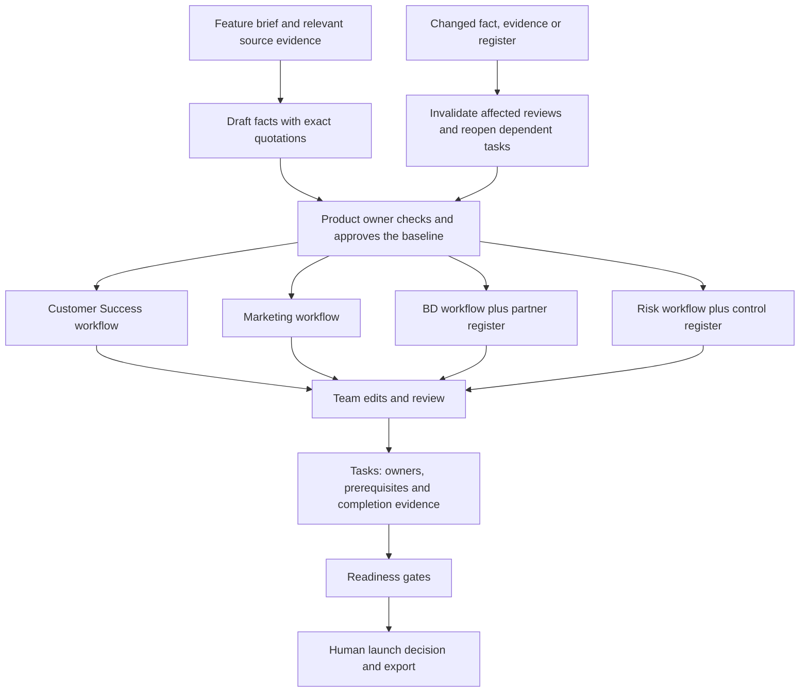

# Feature Launch Orchestrator — V1

**An internal, local capstone application for coordinating a UPI feature launch.**

The application turns a reviewed feature baseline into work for Customer Success, Marketing, Business Development and Risk. Each team receives a draft deliverable, records its review and completes readiness tasks with evidence. The product owner sees outstanding blockers and records the launch decision.

This is a working prototype, not an NPCI system. The included UPI LITE pilot, partner names and control examples are explicitly simulated.

## What is implemented

| Workspace area | What it does |
|---|---|
| Feature facts | Captures evidence, extracts draft facts with the local model, retains exact source quotations and records product-owner approval. |
| Customer Success | Drafts FAQs, support guidance, escalation considerations and briefing preparation. |
| Marketing | Drafts a creative brief, audience/claim guidance, proposed copy and branding/release checks. |
| Business Development | Uses the supplied partner register to draft a shortlist, prioritisation rationale, discovery questions and pilot dependencies. |
| Risk | Uses the supplied control register to draft scenarios, coverage considerations, gaps and proposed assurance. Documented, implemented and tested remain distinct. |
| Readiness | Tracks task owners, dates, prerequisites, evidence and completion. A launch decision requires current approvals and completed required tasks. |
| Change impact | Invalidates affected reviews, reopens dependent completed tasks and marks an existing launch decision for review. |
| History and handoff | Preserves previous deliverables, records changes and exports the launch pack as Markdown. |

## How the work flows

The model proposes content. Python code enforces workflow rules. A generated document is a draft; approving it does not mean that a team has executed the work. Execution is recorded separately through readiness tasks.

The four specialist workflows share the same approved facts. Partner records enter the BD prompt; control records enter the Risk prompt. Team-specific evidence only enters its relevant workflow. Each output distinguishes source summaries, proposals and unresolved questions.

## What technology is used

| Component | Implementation and purpose |
|---|---|
| Local AI | Ollama with the installed **Qwen3.5 9B** model. One model performs five structured workflows: fact extraction and four team drafts. |
| Orchestration | Python and a persistent queue. One job runs at a time to limit local model contention. |
| Data and history | A separate SQLite database stores launch state, revisions, earlier deliverables, audit events and job states. |
| Browser interface | HTML, CSS and JavaScript; no frontend build step or cloud account. |
| Existing RAG integration | A UPI-filtered BM25 evidence picker imports selected passages from Circular Intelligence with document/page provenance. |
| Existing research application | Its Chroma vectors, Qwen embeddings, hybrid retrieval and reranker remain available in the separate circular research app. They are not required for the V1 launch evidence picker. |

There are two explicit drafting modes: **local AI**, which calls Ollama, and **template demonstration**, which creates deterministic teaching examples. The application labels their outputs and never silently substitutes one for the other.

## Evidence and change handling

For AI-generated citations, the model selects permitted source passage IDs. The application copies their original text as quotations. This prevents paraphrased quotations from masquerading as exact source text. It does not prove that an interpretation is correct; reviewers still assess applicability and meaning.

Approvals are tied to the current fact set or deliverable revision. Generation also captures an input fingerprint. If inputs or a deliverable review change while a job is running, its result is marked superseded and is not applied.

For example, changing a control record makes the Risk deliverable stale and reopens Risk completion. If BD readiness depends on Risk, BD's completed readiness task also reopens. BD's document remains approved when its own content inputs are unchanged. Changing a shared feature fact invalidates the team drafts that received that fact.

## V1 boundaries

The application supports a local, single-user demonstration with switchable team roles. Those roles illustrate responsibilities; they are not authenticated enterprise access controls. There are no live partner-system, email, ticketing, publication or production risk-rule integrations.

Readiness represents the recorded approvals and evidence. It is not independent verification of partner readiness, control effectiveness or regulatory compliance. The claim checker has a small set of explicit phrase checks; it is not a comprehensive semantic consistency engine. Production deployment would require authentication, permission enforcement, operational integrations, stronger evaluation and independent domain review.

Implementation, demonstration steps and measured checks are in [the technical guide](LAUNCH_ORCHESTRATOR_V1.md), [demo guide](LAUNCH_DEMO_GUIDE.md) and [validation record](LAUNCH_VALIDATION_V1.md).
