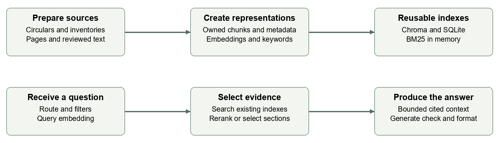

# Circular Intelligence
## Core product guide

**Local research over NPCI circulars | Implemented through v0.5.1 | 27 September 2026**

Circular Intelligence helps users search NPCI circulars, ask questions, summarise a circular and compare selected documents. Each answer keeps links to the circular and page used as evidence. This guide explains what we built, the tools behind it and the flow from source documents to a cited answer.

## What the product does

A feature can appear in several circulars across products and years. The app makes those documents searchable while preserving their separate identities. Users can narrow a question by product, inspect related passages and open the underlying source before using an answer.

The current application supports evidence search, local AI answers, exact-document summaries and comparisons, source review, and Markdown export. Answers can use paragraphs, bullets or a mixture depending on the question and the user's selected style.

## What we used and why

| Component | Role in the project |
|---|---|
| Markdown circulars and inventory JSON | Supply document text, product classifications and source records |
| Python server with HTML CSS and JavaScript | Connect the browser interface to search, models and local data |
| SQLite | Store document, chunk and relationship metadata |
| Chroma vector database | Store embeddings and retrieve passages with related meaning |
| BM25 keyword search | Find exact terminology, titles and circular references |
| Qwen3 embedding 0.6b through Ollama | Convert passages and questions into numerical vectors |
| Quantized MiniLM through ONNX Runtime | Rerank candidate passages locally on the CPU |
| Qwen3.5 9b through Ollama | Draft cited answers and perform automated support checks |

**RAG means retrieval augmented generation:** find relevant source passages first, then give those passages to the language model with the question. We have not trained or fine-tuned Qwen on the circulars. The searchable knowledge is held in the local document and vector stores.

Inference runs locally after the models and dependencies are installed. The app is a working research prototype for the capstone, with no paid model API required.

<!--PAGE-->

# From circulars to a knowledge base

The active collection contains **1,562 searchable documents, 4,826 page records and 14,060 chunks**. The complete register has **1,921 records**, including 359 unavailable or excluded records. Those gaps remain visible instead of silently disappearing from the collection.

## Import and organisation

The importer reads the product inventory JSON files and Markdown documents, preserves source copies, and creates a canonical document register. Listings for the same source URL can share one document identity and multiple product memberships. A matching circular number alone does not merge documents: the same number can occur in different products or years.

Each document retains metadata such as its title, product memberships, reference number, source link and available date information. Fiscal year is stored separately from issue date; missing dates are not invented.

## How chunking works

**Figure 1. Every chunk belongs to one circular and one page. Relationships connect circulars without merging their text.**

The chunker processes each circular page separately. It uses headings and clause boundaries where it can recognise them. Long text blocks are split into windows of up to **220 words**, with **35 words of overlap**; short clause blocks do not automatically receive overlap. A chunk never crosses a page boundary.

Each chunk keeps its document ID, page, section hint, word positions and neighbouring chunk IDs. These fields let the app retrieve a small passage and still show where it came from. Empty extracted pages remain visible as source gaps and are not embedded.

## Why this preserves context

If circular A refers to circular B, the app can retrieve relevant passages from both while keeping their citations separate. It may also include nearby passages from the same document. Reference links and shared-feature hints support navigation; they do not automatically establish that one circular supersedes another.

Accepted source-review corrections are applied as overlays before rebuilding chunks and embeddings. Original extraction remains preserved for inspection.

<!--PAGE-->

# How a question becomes an answer

**Figure 2. The browser uses a Python server to coordinate local storage, Ollama models and the CPU reranker.**

1. **Understand the request.** The app identifies a specific question, summary or comparison. Product, fiscal-year and other filters narrow the eligible documents. Users can select exact circulars to avoid ambiguity.

2. **Retrieve candidate passages.** BM25 finds matching words and references. Neural search embeds the question and queries Chroma for related meaning. Hybrid search combines the two ranked result lists using reciprocal rank fusion.

3. **Rerank focused search results.** For a specific question, MiniLM reads the question and each candidate passage together and scores their relevance. Up to 32 candidates are reranked before direct evidence is selected. This improves ordering; it cannot recover a passage that was never retrieved.

4. **Assemble context.** The app adds a bounded amount of neighbouring or related evidence when enabled. Summaries and comparisons instead select passages across the chosen documents' sections, bypassing the focused reranking route. The trace reports coverage and omissions.

5. **Generate and check.** Qwen receives the question and selected excerpts, drafts source-attributed claims, and checks their support. Only claims passing the configured checks appear in the supported draft.

6. **Present with sources.** The browser displays the answer, citations, warnings and evidence cards. Users can read the source page or export the findings as Markdown.

The current generation settings allow **16,384 context tokens** and up to **3,072 output tokens**. Retrieved evidence has a separate **18,000-character budget**. A larger model context does not mean the entire collection is sent with every question.

<!--PAGE-->

# Answers you can inspect

**Figure 3. A short answer uses a paragraph with an inline S1 citation. The source cards and review details remain available below it.**

## Citation and support checks

The evidence packet assigns source IDs such as S1 to the selected excerpts. Qwen returns structured claims referencing those IDs. The application then follows this sequence: validate citation IDs, check numerical tokens, assess each claim against its cited text, and verify the supporting quotation. Unsupported or uncertain claims are withheld with reasons; if none survive, the app reports that outcome instead of showing an unchecked draft.

An ambiguous reference or unavailable required circular can cause the app to request a clearer selection or abstain. For partial sources, coverage warnings remain visible. The user can open a citation to inspect its evidence and follow the original PDF link where available.

## Formatting follows the question

Automatic answer style can use a paragraph for an explanation, bullets for parallel requirements, or a mixture. The model proposes a layout that refers to claim positions; the application removes withheld claims before rendering it. Stable references prevent a rejected claim from shifting a citation onto another statement. No second model rewrite adds fresh wording after the checks. The browser and Markdown export use the same retained claims and layout.

**These checks assist review; they do not certify correctness.** Generation and support checking use the same Qwen model and can share mistakes. Important findings should be checked against the original source.

<!--PAGE-->

# Indexing and evidence selection

**Figure 4. Preparation builds reusable indexes. Each question searches those indexes and assembles a smaller evidence packet.**

## What happens before a question

The embedding input combines each chunk's title, section heading and text. Qwen3 embedding converts it to a numerical vector, which Chroma stores for similarity search. SQLite retains document and chunk metadata, while BM25 builds a keyword index in memory. The original text remains available alongside these search representations.

Embeddings are reused when the exact input and installed embedding model match the cache. Completed batches are saved, so an interrupted build can reuse prior work. Source corrections require a matching index rebuild; changing only answer style does not change the embeddings.

## What happens for each question

For neural or hybrid retrieval, the question is embedded with the same embedding model. Product and document constraints narrow eligible evidence. In hybrid mode, BM25 and Chroma each contribute up to 100 candidates; reciprocal rank fusion combines their ranking positions. The reranker then evaluates question and passage together for focused questions. Similarity finds candidates; reranking improves their order; neither score is a truth probability.

| Request | How the evidence packet is formed |
|---|---|
| Specific question | Up to eight direct seeds, then bounded related or neighbouring passages; at most 18 chunks |
| Circular summary | Selection rotates across the named document's sections; at most 48 chunks |
| Comparison | Selection rotates across documents and sections; every requested side must be represented; at most 48 chunks |

All routes also obey the 18,000-character evidence budget. Added passages keep their own source IDs and inclusion reasons. Selected-versus-total chunk counts expose partial coverage; even complete indexed-text coverage does not prove the original source was fully extracted.

**Validation and limits:** the saved release reports record 103 passing automated tests and recovery of 55 of 55 expected UPI source anchors in both evaluated modes. This is tested behaviour, not an overall answer-accuracy measure. The collection remains a snapshot with OCR, date and source gaps.
