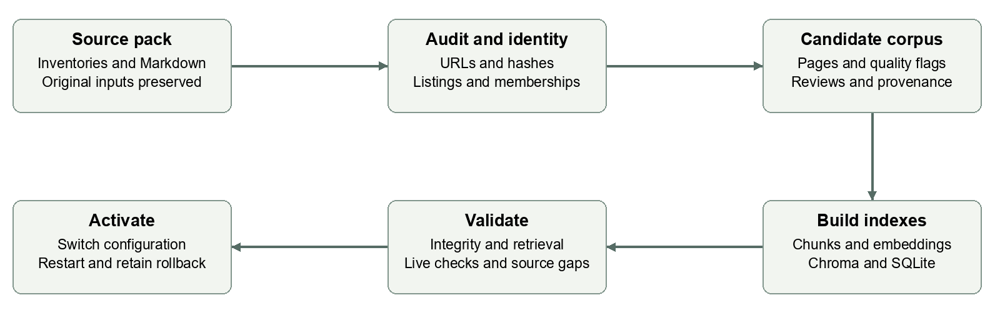
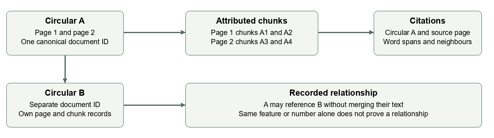
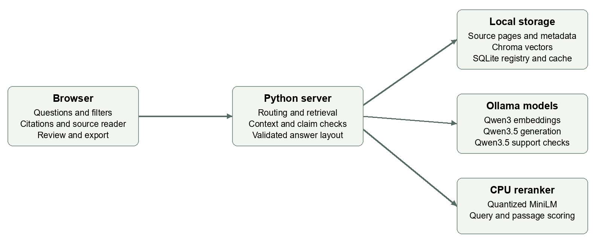
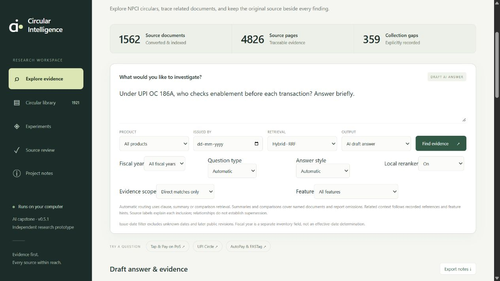
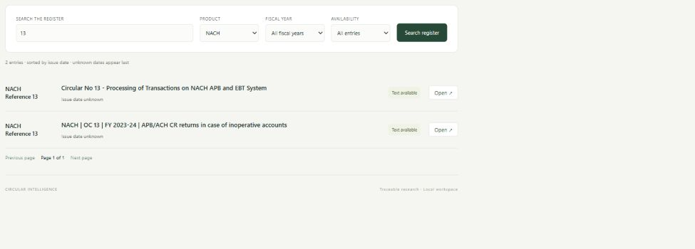
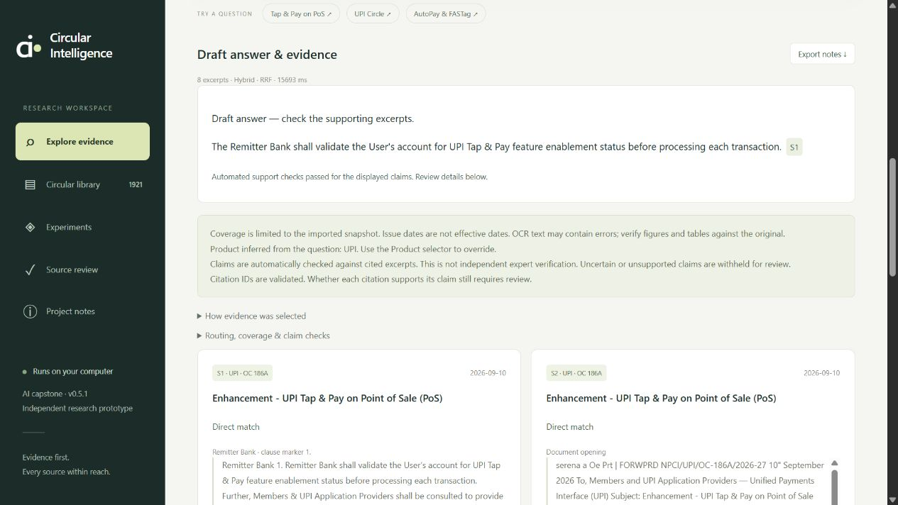

# Circular Intelligence
## Product and implementation document

**Local research over NPCI circulars**

Prepared for the capstone project group and colleagues. This document explains the purpose, implemented experience, data pipeline, technical design, validation and operating procedures of Circular Intelligence through application release **v0.5.1**. It is a product and engineering handover, not an NPCI-issued document or a statement of currently applicable payment rules.

**Document date:** 26 September 2026. **Product status:** working local research prototype. **Active dataset:** all-products-v1. **Prepared from:** the application code, current configuration, structured corpus, saved validation reports and the running interface.

The project turns an existing collection of circulars into a searchable, source-attributed knowledge base. A user can ask a specific question, inspect a circular, summarise it, or compare selected circulars. The application retrieves relevant passages, optionally generates a local AI draft, checks its claims and retains citations to the underlying circular and page. Users can inspect missing coverage and export research notes.

| Current measure | Verified scope |
|---|---|
| Canonical register | 1,921 records, including unavailable material |
| Searchable documents | 1,562 |
| Page records and indexed chunks | 4,826 pages and 14,060 chunks |
| Input collection | 12 product inventories and 1,619 Markdown files, merged with the earlier research pack |
| Validation | 103 Python tests passed; live retrieval, generation and presentation checks recorded |

The implemented product is useful for evidence discovery and an AI-course demonstration. It is not ready to make unattended compliance decisions. Unknown dates, missing originals, extraction errors and incomplete relationship coverage remain visible limitations. The strongest next step is independent, product-balanced answer evaluation and targeted source repair.

**How to use this document:** the first sections explain the product and data, the middle sections explain RAG and user workflows, and the final sections support developers, reviewers and a group demonstration. The PDF is the reading copy; the Word document is editable.

<!--PAGE-->
# Reading guide

The guide is organised as a sequence from product purpose to implementation and operation. A nontechnical reader can start with Product purpose, the three user walkthroughs and Validation. A developer should also read the data, retrieval, maintenance and API sections. A source reviewer should focus on provenance, coverage, claim checks and the review workflow.

| Section | Page |
|---|---:|
| Product overview | 1 |
| Reading guide | 2 |
| Product purpose and business use | 3 |
| Implemented scope and release history | 4 |
| Collection coverage and availability | 5 |
| Importing and preserving the collection | 6 |
| Document identity and metadata | 7 |
| How chunking preserves circular context | 8 |
| System architecture and model roles | 9 |
| Search and local reranking | 10 |
| Question routes and context budgets | 11 |
| Answer generation checks and formatting | 12 |
| Using Explore evidence | 13 |
| Finding and comparing exact circulars | 14 |
| Reading answers and following citations | 15 |
| Source review and quality improvement | 16 |
| Validation evidence and interpretation | 17 |
| Running and configuring the product | 18 |
| Maintaining and restoring the dataset | 19 |
| Code organisation and API contract | 20 |
| Limitations and proposed next steps | 21 |
| Group demonstration and glossary | 22 |
| Evidence and handover reference | 23 |

**Reading conventions:** “implemented” means present in the inspected code or data. “Validated” identifies a recorded check and its limits. “Proposed” identifies future work. Figures are explanatory diagrams or screenshots of the local application. Examples of circular content demonstrate the software; they are not independently reviewed guidance for live operations.

<!--PAGE-->
# Product purpose and business use

## The problem we are addressing

Circulars are distributed across products, years, individual documents and annexures. A feature may be introduced in one circular and referenced or changed in another. Searching filenames or concatenating all documents into a single model prompt makes it difficult to establish which source supports an answer, whether the relevant pages were included and whether an apparently similar reference belongs to another product.

Circular Intelligence provides a research workspace around those source documents. The intended benefit is less manual searching and a more inspectable evidence trail. Time savings and productivity improvements have not yet been measured in a controlled user study.

## Intended users and jobs

| Intended user | Supported job today | Human responsibility |
|---|---|---|
| Product or operations analyst | Find passages about a feature or participant obligation | Check source wording and operational context |
| Research or compliance colleague | Summarise and compare named documents | Determine applicability, conflicts and completeness |
| Source reviewer | Record OCR, date, label or relationship corrections | Compare against the original source |
| Capstone team member | Demonstrate RAG and inspect retrieval behaviour | Interpret evaluation honestly and document failures |

A realistic business scenario is a colleague preparing a briefing on a product feature. The colleague first narrows the product, retrieves relevant evidence, follows recorded references, reads the original pages and exports attributed notes. The AI draft assists the briefing; the colleague remains responsible for deciding what the sources establish.

Another scenario is comparing two circulars with the same reference number but different years. The library allows the colleague to select exact records. Their passages remain separately attributed, so the application does not combine unrelated documents just because their numbers match.

## Product boundaries

The current interface is a single-machine research application. It has no user accounts, enterprise approval hierarchy, team workspace, automated obligation tracker or continuously refreshed website feed. Source reviews record a supplied reviewer name without authenticating that identity. The app does not determine which rule is legally effective today or automatically declare a later circular to supersede an earlier one.

A future NPCI-facing business use case could build on this foundation, but endorsement, operational integration, production deployment and measurable business impact are not implemented outcomes.

<!--PAGE-->
# Implemented scope and release history

The project has progressed from a local proof of concept to a multi-product RAG prototype. The following sequence explains the current implementation without treating older limitations as current ones.

| Stage | Main capability introduced |
|---|---|
| Initial local prototype | Markdown-derived page corpus, keyword and embedding search, local generation, source reader and research-note export |
| v0.3 | Persistent Chroma storage, SQLite registry, page and clause chunking, reference-aware bounded context and reproducible storage checks |
| v0.4 | Question routes, CPU reranker, source-review overlays, feature and participant cues, frozen evaluation set and per-claim support checks |
| v0.5 | Multi-product import, canonical identities and memberships, fiscal-year filters, exact selection, partial-source coverage, embedding cache and guarded activation |
| v0.5.1 | Context-sensitive paragraphs and lists, style overrides, checked-claim layout references and matching Markdown export |

## What works in the current release

The five navigation areas are Explore evidence, Circular library, Experiments, Source review and Project notes. Explore offers keyword, neural and hybrid retrieval; evidence-only or generated output; direct or related context; product, fiscal-year, issue-date and feature filters; routing and reranker controls; and answer style selection.

The library contains both available and unavailable records, with 50 results per page. The source reader exposes full imported pages, indexed chunks, source links, metadata quality, coverage warnings, relationships and provenance. Reader actions bind a summary or comparison to exact document IDs.

Generated answers retain per-statement citations and automated support checks. Unsupported or uncertain claims are withheld visibly. Automatic formatting may use prose, bullet lists, numbered steps or a mixture. The user can explicitly request Paragraphs, Bullet points or Paragraphs plus bullets. Exported notes preserve the chosen structure and evidence details.

## What implementation completion means

The requested multi-product and formatting changes are implemented and tested. It does not mean that all source text is correct, all references are mapped or all possible questions are answered correctly. Those are ongoing data-quality and research objectives. The roadmap later in this document separates these objectives from completed software features.

The original corpus and pre-change implementation files remain available for rollback. A new feature release does not silently delete the prior collection or its review evidence.

<!--PAGE-->
# Collection coverage and availability

The active register merges the earlier UPI research pack with inventories generated between 9 and 15 September 2026. Retained UPI material extends through 22 September. Incoming archive-year fields span 2009 to 2026; they are not verified issue dates. The import was not reconciled against the live NPCI website on the document date.

| Product membership | Register records | Searchable records |
|---|---:|---:|
| AePS | 110 | 97 |
| BHIM Aadhaar | 2 | 2 |
| CTS | 247 | 234 |
| IMPS | 142 | 126 |
| NACH | 419 | 382 |
| NETC | 55 | 52 |
| NFS | 448 | 245 |
| Others | 1 | 1 |
| Product Compliance | 9 | 9 |
| RuPay | 232 | 215 |
| UPI | 299 | 245 |
| e-KYC Setu | 4 | 3 |
| e-RUPI | 5 | 3 |

**These rows overlap.** A shared circular may belong to several products. They must not be added to derive the unique-document total of 1,921 or the searchable total of 1,562. These are canonical membership counts, not raw counts of files in each supplied folder.

| Availability in the canonical register | Count |
|---|---:|
| Converted text available | 1,562 |
| No public PDF recorded | 301 |
| ZIP or attachment not extracted | 53 |
| Needs source review and excluded from retrieval | 2 |
| Failed public link | 1 |
| Cancelled as listed | 1 |
| Extraction failed | 1 |

The 359 non-searchable records remain in the register instead of disappearing from coverage reporting. The 4,826 page records include blank extracted pages and other source-quality records; this number is not a count of fully verified PDF pages. New original PDFs were absent from the supplied collection.

<!--PAGE-->
# Importing and preserving the collection



**Figure 1.** The import builds a separate candidate corpus before activation. The Downloads source folders are read and copied, not overwritten.

The importer reads the product inventory JSONs and associated Markdown files. It audits source links, page markers, duplicates and extraction status, and creates a new staging directory. Raw inventories and all 1,619 Markdown files are copied into the candidate dataset. A manifest records SHA-256 checksums for 1,631 Markdown and inventory files, providing a repeatable way to detect a changed source copy.

Website listing records and canonical documents are separate concepts. Listings with the same normalized source URL can point to one canonical circular, with their original inventory metadata and product memberships preserved. Different URLs are not merged merely because their extracted bodies look identical. Alternative Markdown variants remain available with paths and hashes.

On overlap with the existing pack, the older project's reviewed text and IDs are preserved. All original 916 chunks retain their IDs and text. Newer UPI circulars such as 186A and 227A remain even though they were absent from the incoming older snapshot. All 1,955 incoming listing rows remain traceable through source-listing records.

Two known metadata/body conflicts are quarantined: incoming RuPay record 726 and IMPS record 533. The possible new text for previously failed UPI 76B remains a candidate, not an automatic recovery. These decisions prevent a convenient extraction from silently overriding a known source-quality issue.

The staging directory is promoted to a dataset directory only after structural checks. Embedding build, retrieval validation and live checks follow. Guarded activation then changes the active configuration; a server restart loads it. An existing destination is refused, providing a practical boundary against accidental corpus overwrite.

<!--PAGE-->
# Document identity and metadata

## One circular can have several listings

A canonical document ID identifies one source record for retrieval. Existing IDs are retained for verified overlaps. New IDs derive from a source identity using a SHA-256 suffix, rather than only a circular number. A number such as 13 can recur across products and years, so number alone is not a safe unique key.

The native reference and product memberships serve different purposes. The reference helps identify the circular; memberships determine where it should appear in product-filtered searches. A shared compliance document can be relevant to several products while each chunk still belongs to exactly one canonical document.

| Record or field | Meaning and use |
|---|---|
| Document ID | Canonical owner of pages, chunks, reviews and citations |
| source_listings | Original inventory entries, including product and generation timestamp |
| product_memberships | All recorded product categories for membership-aware filtering |
| circular_number and reference_label | Source reference; missing numbers are not invented |
| issue_date | Verified or preserved issue metadata; many imported values remain null |
| fiscal_year and archive_year | Inventory classifications, stored separately from issue date |
| source_pdf and local_pdf | External source link versus an actually saved original |
| source_coverage | Page records, empty/thin pages and page-count verification status |
| import_variants and hashes | Alternative source copies and integrity/provenance evidence |

## Dates and relationships require care

An inventory fiscal year does not establish a publication date, an effective date or the date on which a requirement ceased to apply. The Issued by filter excludes unknown dates and known later issues/public revisions. It does not reconstruct a historical rulebook. Fiscal year is a separate filter for inventory-based navigation.

Relationships are explicit links, not merged text. Existing imported reference links and reviewed relationship annotations are retained in the registry. A reviewer may record references, clarifies, amends or supersedes when an anchored source supports that choice. A matching number, similar title, shared feature or later date is not enough to establish supersession.

Circular references are resolved within the relevant product, year and filters. If more than one record fits, the answer path returns choices and abstains. Unavailable records are considered during disambiguation, so the engine cannot simply select another available record with the same number.

<!--PAGE-->
# How chunking preserves circular context

The project does not combine all circulars into an undifferentiated text bundle. Chunking is deterministic and begins within one circular, then processes one page at a time. Headings and numbered or lettered clauses suggest boundaries. A heading stays with its first clause where the heuristic recognises that structure.

Long blocks use a maximum of 220 words with 35 words of overlap between windows. Short clause blocks do not receive automatic overlap. A chunk never crosses a source page. Section identity and previous/next links may continue across pages, but only within the same document. These links allow context expansion without losing ownership.



**Figure 2.** Separate circulars retain separate pages, chunks and citations. A recorded reference connects documents without concatenating them.

## A worked source example

The current opening chunk of UPI 186A illustrates the metadata contract. Its raw OCR contains visible noise; preservation of offsets is not a claim that the extracted words are perfect.

| Field | Stored example |
|---|---|
| Chunk ID | 2026-OC-186A:p1:v3c1 |
| Document ID and page | 2026-OC-186A, source page 1 |
| Word span | Start 0, end 103, end excluded |
| Section | Document opening |
| Chunker and extraction | clauses-v1 and OCR |

Offsets refer to the effective page text after accepted correction overlays. Whitespace is normalised when creating chunk text. The original extraction and accepted corrections remain inspectable in the reader. Every chunk carries its source metadata, heading hint, clause label, feature/participant cues and neighbouring IDs.

Blank page records remain visible but are never embedded. Tables are not structurally reconstructed, and headings/clauses are recognised by rules rather than by an LLM. OCR headers or footers can therefore become imperfect section hints. Read the full page and original PDF when exact wording matters.

<!--PAGE-->
# System architecture and model roles



**Figure 3.** The browser talks to a local Python server. Retrieval, generation and checking use local stores and installed models. Opening an official source link is a separate external browser action.

| Component | Responsibility |
|---|---|
| Browser interface | Filters, questions, evidence, reader, review forms and export |
| Python application | HTTP API, routing, retrieval, context assembly and validation |
| BM25 in memory | Lexical matching over titles and passage text |
| Chroma on disk | Persistent passage vectors and similarity retrieval |
| SQLite on disk | Document, chunk, feature and relationship registry snapshots |
| Qwen3 embedding 0.6b through Ollama | 1,024-dimensional passage and query embeddings |
| Quantized MiniLM through ONNX Runtime | Local CPU scoring of query-passage candidates |
| Qwen3.5 9b through Ollama | Cited draft generation and subsequent support assessment |

The interface uses HTML, CSS and JavaScript. The server uses Python's local HTTP server and project modules; this application is not built around a managed cloud RAG service. Models are installed separately, and the current workflow needs no paid model API key.

RAG means retrieval augmented generation: the model receives selected source passages with each question. The project does not fine-tune Qwen on this corpus. Adding documents changes the searchable evidence store, not the model's trained weights. Chroma handles similarity; SQLite and the structured source files preserve the ownership and relationships that similarity alone cannot establish.

<!--PAGE-->
# Search and local reranking

## Candidate retrieval

Keyword search uses BM25, which rewards informative matching words while accounting for document length. The implementation tokenises title and passage text, weights the title and supports explicit circular references. This is useful for exact terms and named circulars, but it can miss a differently worded question.

Neural search embeds the question with the configured retrieval instruction, then queries eligible Chroma records. It can find related wording even without an exact term match. Similarity is not proof that a passage answers the question, and the project does not claim a calibrated relevance threshold.

Hybrid retrieval combines the top lexical and dense rankings with reciprocal rank fusion. A passage receives contributions of 1 divided by 60 plus its rank in each list. This combines rank positions rather than treating unlike raw BM25 and vector scores as directly comparable. The current implementation considers up to 100 items from each ranking before selecting candidates.

Product membership, issue-date/public-revision, fiscal-year, feature and exact-document constraints narrow the eligible set. Unknown issue dates are excluded when a cutoff is supplied. An empty eligible set or unresolved required circular does not become permission to answer from another product.

## What the local reranker adds

The reranker reads the question and each candidate passage together. Its input includes the document title, section heading and passage. This cross-encoder can assess the relationship between that particular question and that particular text more directly than a single precomputed document vector.

The installed model is Xenova/ms-marco-MiniLM-L-6-v2, pinned to revision a09144355adeed5f58c8ed011d209bf8ee5a1fec. Quantized ONNX inference runs on CPU, in batches of eight, with up to 512 tokenizer tokens per pair and four intra-operation CPU threads. Files are hash-checked; query-time ranking does not download a model.

For a specific question, up to 32 candidates are reranked, then up to eight direct seeds are chosen with document-diversity limits. The reranker cannot recover a passage that never entered the candidate set. Its score is a relative ranking value, not a truth or confidence percentage. The UI toggle supports an on/off experiment.

Summaries and comparisons bypass this passage-ranking stage because breadth across named documents is the objective. That distinction prevents a broad request from being reduced to only a few highly similar clauses.

<!--PAGE-->
# Question routes and context budgets

Automatic routing uses English question cues; the user can override Question type. Exact document selection is preferable when references are long, incomplete or repeated across years. Up to four distinct document IDs can be selected.

| Route | Selection behaviour | Important limit |
|---|---|---|
| Specific question | Candidate search, optional reranking, up to eight direct seeds | Related mode may expand, but total context is bounded |
| Circular summary | Round-robin selection across the named document's sections | The source can exceed the passage or character budget |
| Compare circulars | Round-robin selection across sections and documents | Every required side must be available and represented |

Direct scope stops at direct matches. Related scope can add evidence from up to two recorded reference documents, one same-feature passage and up to six immediate same-section neighbours. Reference expansion is limited to one hop. Every addition retains its own citation and an inclusion reason such as Direct match, Recorded circular reference or Surrounding passage.

| Current setting | Value |
|---|---:|
| Specific-question passage ceiling | 18 |
| Summary or comparison passage ceiling | 48 |
| Evidence character budget | 18,000 |
| Generation context window | 16,384 tokens |
| Maximum draft output | 3,072 tokens |
| Maximum support-check output per claim | 650 tokens |

Characters and tokens are different units. The evidence budget estimates passage, title and metadata cost; prompt/schema overhead also consumes model context. Increasing the number of indexed circulars does not mean sending all of them to the model. Bigger output limits permit detail but do not guarantee longer, better or complete answers.

## Coverage has two meanings

The trace reports included versus total chunks for each selected summary/comparison document. All available chunks fitting is not equivalent to a verified complete source: an empty extracted page or unknown original PDF page count makes full-source coverage incomplete or unverified. The source reader exposes those gaps.

An unavailable or ambiguous required circular blocks generation for that request. A comparison is also withheld if the budget cannot include evidence from every requested side. For partial but usable sources, the app can return evidence with explicit warnings; it does not promise that all requirements were included or mentioned in the draft.

<!--PAGE-->
# Answer generation checks and formatting

## From evidence to checked claims

For AI draft output, local Qwen receives the question, selected excerpts, metadata, route and coverage notes. The prompt instructs it to treat source text as data, avoid outside knowledge, attribute statements to sources and abstain when evidence is insufficient. Temperature is zero and thinking output is disabled in the configured calls.

The response must fit a structured schema. Every factual claim has text and source IDs. Citation validation rejects missing or invented IDs. Truncated or malformed responses are surfaced as errors instead of being silently presented as complete answers.

For each claim, deterministic guards compare numerical tokens with the cited text and source metadata. OCR currency ambiguity can trigger review. The local model then labels support as supported, unsupported or uncertain and provides quotations. Quotations must match cited text after whitespace and typographic punctuation normalisation; spelling, numbers and missing words are not silently repaired.

Only claims that pass the configured checks appear in the supported draft. Other claims remain in a separate withheld panel with reasons. If checks fail or become unavailable, claims are withheld rather than assigned a positive label. If no draft claim survives, the answer reports that outcome.

**This is not independent verification.** Generation and checking share the same Qwen model and can share blind spots. A well-supported claim can still be incomplete, and the checks do not establish present-day applicability. Written numbers versus digits and imperfect OCR can also cause conservative rejection of plausible statements.

## Formatting follows context

The model proposes a separate layout referencing claim positions. A block can be a paragraph, bullet list or ordered steps. Layout has no free-text introduction or conclusion field, so formatting cannot introduce a new unchecked factual statement. Stable draft indices ensure that removing a rejected claim cannot shift a reference onto another claim.

The formatter validates legal block types and exactly-once claim coverage, then removes withheld claims and empty blocks. Invalid layouts fall back to a safe arrangement of retained claims. Automatic mode can use paragraphs for explanations, bullets for parallel requirements and a mixture for an overview plus details. Explicit style controls are enforced, with a paragraph fallback when there is too little content to justify mixed output.

Citations remain beside their statements. A single compact support notice replaces a repeated notice after every sentence. HTML and Markdown export use the same structure. Model text is escaped; arbitrary model HTML is not executed. No second rewriting model call is made after checking.

<!--PAGE-->
# Using Explore evidence



**Figure 4.** The v0.5.1 workspace exposes retrieval controls and an independent Answer style control. Counts describe the active local dataset.

Start with Hybrid retrieval and AI draft answer. Select a product when the question is product-specific. Use Automatic Question type unless you want to force a specific question, summary or comparison route. Keep Answer style Automatic for context-sensitive prose and lists, or choose an explicit preference.

For a first example, ask: “Under UPI OC 186A, who checks enablement before each transaction?” This is a demonstration of source attribution, not an instruction to apply an unreviewed answer to production operations. Click Find evidence, wait for retrieval and checks, then inspect the citations and source excerpts.

Choose Source excerpts to investigate retrieval without generation. Hybrid and neural modes still need Ollama for the query embedding. Keyword search with Source excerpts can operate without Ollama; the CPU reranker still needs its installed local files if enabled.

Use Direct matches only to remove reference/feature/neighbour expansion. Use Include related context when the question benefits from surrounding or recorded reference material. The trace explains each inclusion, allowing a reviewer to distinguish directly retrieved text from added context.

Issued by excludes unknown issue dates. If newly imported documents seem to disappear, check that filter before assuming they are missing. Fiscal year is often the more appropriate inventory filter, but it does not establish an effective date.

<!--PAGE-->
# Finding and comparing exact circulars



**Figure 5.** Two NACH records share reference 13 but describe different subjects. Exact selection prevents accidental identity mixing.

In Circular library, choose a product, enter a subject or reference and optionally set Fiscal year or Availability. Click Search register. The library shows 50 records per page and keeps unavailable entries visible. Unknown issue dates appear last in its date-based ordering.

Open a result to inspect its title, native reference, product memberships, source quality and page text. Summarise this circular selects that exact ID and returns to Explore. Click Find evidence to run the request. For comparison, use Add to comparison in each desired reader, then run the prepared question.

Selecting exact records clears previous product, year, feature and cutoff controls so stale filters do not unintentionally hide the chosen record. Typing a new question clears the exact selection. Always inspect the Selected circulars panel before submitting a summary or comparison.

The two NACH reference-13 documents were exercised in browser validation. The result contained 22 excerpts, with 7 of 7 chunks from one record and 15 of 47 from the other. Partial or unverified coverage remained explicit. Including both sources did not imply full coverage of the longer circular.

If a typed question such as “What does OC 13 require?” is ambiguous, the app shows candidate records and does not guess. Inspect a candidate or narrow product/year. If a required comparison side has no converted text or is quarantined, its requirements cannot be inferred from the title or another circular.

<!--PAGE-->
# Reading answers and following citations



**Figure 6.** A short response can be a paragraph with an inline citation. The source and support-check details remain accessible below the draft.

Read the draft together with its warnings. A citation button such as S1 scrolls to the relevant source card. Each card includes the circular reference, document title, source page, excerpt, extraction/review status and reason it was included. Read page opens the full imported page in the reader; Official PDF opens the external source link.

The reader distinguishes a Saved original PDF from an original that is not saved locally. New imported documents generally have external links only. Page text, chunk boundaries and word offsets can be inspected even when the original PDF must be opened separately. A missing extracted page is displayed as a gap, not silently removed.

Expand Routing, coverage and claim checks to see the route, reranker activity, document coverage and per-claim reasons/quotes. Open the withheld-claims panel when present. A support label records an automated check; it is not a certification from a source expert.

Export notes downloads Markdown containing the question, filters, selected IDs, answer style, claims, support details, warnings and attributed excerpts. The corpus fingerprint identifies the input snapshot. The export preserves paragraphs and lists rather than converting every answer back into bullets.

Before sharing an important finding, inspect the original source, ensure the cited passage supports the entire claim and check whether omitted sections or later material could change its interpretation. The tool exposes evidence; it does not replace that review.

<!--PAGE-->
# Source review and quality improvement

The quality workbench turns discovered source problems into traceable annotations. It flags candidate OCR/currency issues, thin or empty text, and missing metadata. A flag identifies review work, not a proven error. Current feature and participant labels are largely heuristic.

## Review procedure

1. Open Source review and inspect the flagged document/page. Compare the original PDF page image, using the saved original where available or the external source otherwise.
2. Enter the exact document ID and page, then Load source and fingerprint. The hash binds the proposed decision to the text being reviewed.
3. Choose OCR correction, date metadata, feature/participant mapping or circular relationship. Supply an exact anchor phrase and the proposed value or replacement.
4. Enter a reviewer name and note. Save Proposed until reviewed; save Accepted only after the source supports the change. Proposed/rejected records stay in the audit trail without altering retrieval.
5. Stop the server, rebuild with run.cmd embed and restart. A running process continues to use its previous snapshot until that maintenance step.

Accepted overlays apply to copies before chunking. Raw extraction remains intact. Source-hash mismatches and conflicting accepted corrections are rejected rather than silently modifying a different passage. The ten initial bootstrap annotations are labelled assistant_source_checked; they are not human approval of the entire corpus.

Review records are append-only through the UI, with no delete/revoke button. The existing guide describes inverse corrections and developer-led cleanup with backups. Review provenance checks can establish what was reviewed and against which text; they cannot establish that a reviewer made the correct interpretation.

## Features participants and relationships

The expanded dataset has 18 product-scoped feature rules. Rules inspect title and clause text, with accepted source-bound overrides. Participant labels use explicit cue patterns from the existing vocabulary, including remitter bank, issuer bank, beneficiary bank, payer/payee PSP, UPI app, acquiring bank and primary/secondary user. It is not a complete ontology across all products.

A relationship review needs an existing target document and a source anchor. Use a stronger relationship such as amends or supersedes only when the original text establishes it. Cross-product links are not automatically inferred from recurring numbers or similar feature names. This remains an important area for manual enrichment and future evaluation.

<!--PAGE-->
# Validation evidence and interpretation

The project maintains automated checks, recorded retrieval evaluations and live model/browser examples. Their purpose is to detect regressions and expose failure modes. They are not evidence of zero defects or expert-level answer accuracy.

| Validation layer | Recorded result | What it establishes |
|---|---|---|
| Current Python suite | 103 tests passed | Tested behaviour for retrieval, provenance, storage, review and formatting |
| Source preservation | 1,955 listing rows retained; 1,631 copied files hash-verified | Traceability and integrity of the copied inputs |
| Prior corpus regression | 916 original chunks preserved | IDs/text of the prior chunk corpus survived expansion |
| Storage integrity | SQLite checks passed; 14,060 vectors ready | Tested registry consistency and vector record coverage |
| Frozen UPI evaluation | 55 of 55 expected anchors for both evaluated modes | Expected evidence retrieved with explicit UPI filtering |
| Product isolation | 12 product groups passed | Selected/broad-query sources respected tested memberships |
| Live product cases | Seven examples and two negative cases | Generation/checking and abstention exercised on real local models |
| Formatting cases | Paragraph, bullets and mixed layouts passed | Requested presentation types and checked-claim layout worked |

The frozen set contains 50 AI-assisted questions: 32 clause questions, six summaries, six comparisons and six negative cases. Positive cases have proposed source-page anchors. They await independent source and answer review. The development/reserved-review split is not an independently authored held-out benchmark.

Anchor recall asks whether expected evidence appeared, not whether a generated answer was correct, complete or currently applicable. The product-isolation smoke checks are intentionally title-derived or source-selected. Broad generalisation across new product questions remains unmeasured.

The recorded embedding build took 926.78 seconds, approximately 15.4 minutes. Seven live product examples took roughly 5 to 15 seconds in their recorded runs. Formatting examples took about 15, 18 and 37 seconds. These observations depend on model state, evidence size and the number of sequential claim checks; they are not latency guarantees.

Several live drafts exceeded a requested number of claims or retained OCR spelling. An earlier numeric claim was conservatively withheld. These limitations are documented instead of being removed from the interpretation of the results. The independent-review worksheet is the starting point for a defensible capstone accuracy study.

<!--PAGE-->
# Running and configuring the product

## Existing installation

Circular Intelligence is a browser application, not a separately installed desktop executable. On the project machine, open Ollama, open the project folder and double-click run.cmd. Browse http://127.0.0.1:8765 and keep the server terminal open. Ctrl+C stops a terminal-launched server; Ollama is a separate process.

The current project folder is:

```text
C:\Users\Admin\Documents\Codex\2026-09-23\i-have-a-set-of-circulars
```

In PowerShell:

```powershell
cd 'C:\Users\Admin\Documents\Codex\2026-09-23\i-have-a-set-of-circulars'
.\run.cmd
```

Use run.cmd if run.ps1 reports that scripts are disabled. No system-wide execution-policy change is necessary. If the address is already in use, first check whether the existing application is already running rather than starting multiple copies.

## Fresh installation and settings

The project uses a pinned Python environment; Python 3.12 is the tested version. setup.cmd prepares dependencies and the pinned reranker. A new machine also needs Ollama, the configured qwen3.5:9b and qwen3-embedding:0.6b models, the source/data files and correct local paths. Model downloads require network access during setup. Runtime inference is local.

config.json selects the active data directory, models, Ollama address and budgets. Current Ollama URL is http://127.0.0.1:11434. Generation uses 16,384 context tokens, up to 3,072 output tokens and a 300-second model timeout. The evidence budget is 18,000 characters. Profile another machine before assuming it has adequate memory or similar response times.

| Symptom | First action |
|---|---|
| Browser cannot connect | Start run.cmd and inspect terminal output |
| Model connection error | Start Ollama and check the installed model names |
| Stale or missing neural index | Stop server, run run.cmd embed, then restart |
| Too few results after filtering | Check product, exact selection and unknown issue-date exclusion |
| First answer slow | Allow model loading and sequential checks; observe elapsed time |
| Original PDF not local | Use the external official link or restore the earlier source pack |

No re-embedding is required merely to use a different answer style or change output/context limits.

<!--PAGE-->
# Maintaining and restoring the dataset

## Rebuilding and caching

After accepted source reviews or structured-input changes, stop the app, run run.cmd embed and restart. Merely editing a copied Markdown file does not change already structured pages or vectors. A change to the embedding model requires a matching rebuild; changing only the answer model does not.

The embedding cache is keyed by model name, installed model digest and exact embedding input, including title, heading and text. Completed batches are committed so an interrupted build can reuse vectors. The expanded build computed 13,700 inputs and recorded 360 reuse hits for 14,060 final vectors. Cache reuse avoids repeated computation; it is not automatic website synchronization.

Chroma builds a new physical collection and publishes an active manifest only after completion checks. SQLite keeps fingerprinted registry snapshots. The chunk/metadata fingerprint and model digest detect stale combinations. Old collections are retained; automatic cleanup of old or failed-build collections is not implemented.

## Import and activation

tools/import_products.py creates a new candidate directory and config.products.json. The running app reads config.json. Validation/live scripts for the expanded candidate read the candidate configuration, so distinguish the two when maintaining a future release.

The importer targets the inspected inventory schema and the preserved v0.4 baseline. Future v0.5 review annotations are not automatically carried into a new import. Reconcile them deliberately before refreshing the source pack. Some tests contain fixed v1 counts; update fixtures for a real dataset change without turning changed expectations into a claim of correctness.

Activation requires current matching validation/live reports, a ready vector index, matching fingerprints/model digest and unchanged copied-source hashes. Then restart the server. Detailed commands are in docs/MULTI_PRODUCT_IMPORT.md.

## Rollback and backup

Stop the server before restoring the prior dataset configuration:

```powershell
.venv\Scripts\python.exe -X utf8 tools/activate_corpus.py --rollback
.\run.cmd
```

This selects the preserved v0.4 data using compatible code and does not delete v0.5 data or reviews. Reactivation without --rollback requires the validation guards again. The pre-expansion code/config/UI/docs are in versions/v0.4.0; pre-formatting files are in versions/v0.5.0. These directories are snapshots, not standalone runnable copies of the full dataset. Back up active inputs, review annotations, config and relevant source originals before maintenance.

<!--PAGE-->
# Code organisation and API contract

| Module or directory | Current responsibility |
|---|---|
| app.py | Engine, lexical/hybrid search, model calls, HTTP API and CLI |
| ingestion.py | Deterministic page and clause chunking |
| product_scope.py | Membership, fiscal-year and exact-reference resolution |
| adaptive_context.py | Route-specific evidence, related expansion and coverage |
| registry.py and vector_store.py | SQLite metadata/relationships and Chroma persistence |
| embedding_cache.py | Exact-input/model vector cache and resumable build |
| quality.py | Source overlays, review validation, flags and label enrichment |
| reranker.py and claim_check.py | Local candidate reranking and claim support checks |
| answer_format.py and web/answer_format.js | Checked-claim layout and safe HTML/Markdown rendering |
| web and tools | Browser application, audits, import and guarded activation |

## Local API surface

GET endpoints provide /api/stats, /api/library, /api/document?id=..., /api/pdf?id=..., /api/review and /api/evaluation?method=.... POST /api/answer performs research; POST /api/review records a validated annotation. These are local application endpoints, not a public service contract.

An answer request supplies query, method (bm25/vector/hybrid), mode (evidence/generate), series (the product selector), fiscal_year, cutoff, feature, scope, route, rerank, document_ids and answer_style. Most fields have defaults. The question is limited to 2,000 characters; exact selection accepts up to four distinct IDs.

```json
{
  "query": "Summarise the selected circular",
  "document_ids": ["2026-OC-186A"],
  "method": "hybrid", "mode": "generate",
  "route": "summary", "scope": "strict",
  "answer_style": "auto"
}
```

The response contains sources, claims, answer_blocks, flagged_claims, claim_checks, warnings, abstained, elapsed_ms and retrieval_trace. The trace reports selected chunk IDs, budgets, routing, ambiguity candidates and coverage. Stable draft indices connect formatting to the original claims after filtering. Clients should display warnings and withheld status alongside the answer rather than discarding them.

The historical 12-case Experiments smoke set is separate from the expanded validation suite. Its score should not be presented as multi-product answer accuracy.

<!--PAGE-->
# Limitations and proposed next steps

## Operational and data boundaries

The server binds to 127.0.0.1 and has same-origin/payload checks and a content-security policy. The renderer escapes model text. These protections do not turn it into an authenticated, audited enterprise service. No independent security audit or multi-user production readiness claim is made. Do not expose the local service publicly as a deployment shortcut.

Inference and stored indexes remain local in this implementation. Initial dependency/model downloads and clicking official PDF links involve external services. There is no automatic cloud-generation fallback. Local files and machine access still need normal organisational controls if a future corpus includes non-public content.

Missing originals, empty/thin pages, noisy OCR, unverified dates and unexplored duplicate/body conflicts can affect evidence quality. The 359 gaps and two known quarantines do not exhaust every possible source problem. Feature/role labels and section boundaries are heuristic, and related context is deliberately bounded. Similarity search can return a neighbour that is topically related but unhelpful.

## Proposed roadmap

| Priority | Proposed work | Evidence of success to seek |
|---|---|---|
| 1 | Independent evaluation across products, paraphrases and negative cases | Reviewed citation support, correctness, omissions and abstention results |
| 2 | Original-PDF acquisition, extraction repair and date verification | Fewer unresolved page/metadata gaps with source-bound review records |
| 3 | Reviewed relationship and participant coverage | Correct source-anchored links and labels on a reviewed sample |
| 4 | Better tables, complex queries and answer completeness | Measured improvement on a frozen difficult-case set |
| 5 | Controlled refresh and review migration | Repeatable change detection without losing prior annotations |
| 6 | Team pilot and production design | User benefit measurements plus authentication, audit and deployment review |

These items are proposals, not completed features or delivery commitments. An obligation tracker, policy-change alerts, approval workflows and enterprise connectors would be new product work. The existing project can supply attributed research for them, but it does not yet manage their operational decisions.

For the capstone, measure source-anchor retrieval separately from answer correctness, citation support, completeness, correct abstention and response time. A baseline comparison and independently reviewed cases make a stronger submission than a single percentage described as overall accuracy.

<!--PAGE-->
# Group demonstration and glossary

## Suggested demonstration sequence

1. Show the active corpus counts and explain that missing entries remain in the register. State the inventory snapshot dates.
2. Ask a focused UPI question in Source excerpts mode, then generate a draft. Follow a citation to its source page.
3. Compare Keyword and Hybrid retrieval on the same question. Explain what the embedding model and reranker each contribute; do not equate a rank score with confidence.
4. Search NACH reference 13 in the library and select two exact records for comparison. Inspect their separate coverage counts.
5. Ask an ambiguous reference or compare a known circular with OC 999. Show the abstention/missing-source behaviour.
6. Demonstrate Automatic versus explicit Answer style, export the notes, and show the source review workflow without accepting an unverified correction.

Close with measured validation results and the independent-review work still required. This sequence demonstrates both usefulness and boundaries without relying on the model to answer every request successfully.

| Term | Meaning in this project |
|---|---|
| RAG | Retrieve source passages and supply them to a model for an answer |
| Embedding | Numeric representation used to find related text |
| Vector database | Store that searches those numeric representations |
| BM25 | Keyword-based ranking method |
| RRF | Rank-fusion method combining lexical and neural candidate lists |
| Reranker | Model that scores a question and candidate passage together |
| Chunk | A source-attributed passage, bounded by one document and page |
| Canonical document | One retrieval identity, possibly linked to several website listings |
| Fingerprint | Hash identifying a specific content/metadata snapshot |
| Overlay | Source-bound reviewed change applied without overwriting raw extraction |
| Abstention | Withholding an answer when the required evidence is insufficient or unresolved |
| Context window | Model input/output capacity, measured in tokens |
| Coverage | How much indexed/source material was represented, not answer correctness |

The current software is an inspectable foundation for a business-oriented capstone. The group can strengthen it most effectively by reviewing realistic questions and using observed failures to prioritise improvements.

<!--PAGE-->
# Evidence and handover reference

This document is based on the local implementation and preserved reports, not a new external literature review or a fresh crawl of the NPCI website. Documentation-only work did not change the corpus, model configuration or application algorithms. Runtime version and index readiness were checked during preparation.

| Source in the project | What it supports |
|---|---|
| PROJECT_STATUS.md and config.json | Current release, scope and active settings |
| data/all-products-v1/index.json | Canonical counts, memberships and availability |
| data/all-products-v1/corpus.json | Import provenance and snapshot description |
| data/all-products-v1/source_manifest.json | Copied source integrity manifest |
| data/all-products-v1/embedding_build.json | Actual vector counts, dimensions, digest and build timing |
| reports/v05_validation.json | Source/hash/storage checks and retrieval/product smoke results |
| reports/v05_live_answers.json | Seven product generation examples and abstentions |
| reports/v051_unit_tests.txt | Recorded passing 103-test suite |
| reports/v051_live_formatting.json | Paragraph, bullet and mixed live-model cases |
| reports/v051_closure.json | Formatting release closure and unchanged fingerprint |
| docs/ARCHITECTURE_V05.md | Multi-product implementation details and boundaries |
| docs/ANSWER_FORMATTING.md | Presentation design and validation |
| docs/MULTI_PRODUCT_IMPORT.md | Import, activation, maintenance and rollback instructions |
| evaluation/rag_cases.json and independent_review.csv | Frozen draft evaluation set and human-review worksheet |

## Handover files

The reading copy is Circular_Intelligence_Product_Document_v051.pdf. The editable companion is Circular_Intelligence_Product_Document_v051.docx. Their source content is docs/PRODUCT_DOCUMENT.md and the reproducible builder is docs/build_product_document.py. Screenshots/diagrams are retained in docs/product-assets. Earlier v0.4 flow PDFs remain historical.

Do not send the Python virtual environment, model binaries or vector databases merely as reading material. A colleague who needs to run the application needs the source/data/configuration and setup instructions, not just this document. Machine-specific paths must be adapted deliberately.

**Suggested ownership for the group:** nominate a source reviewer to check evidence, a developer to manage reproducible builds and changes, and a demo coordinator to collect realistic questions. These are suggested responsibilities, not assigned people or existing approval roles.

**Document control:** this is the v0.5.1 product baseline dated 26 September 2026. Future code, corpus or review changes should update counts, screenshots, validation references and known limitations before the document is reused as a current product description.
