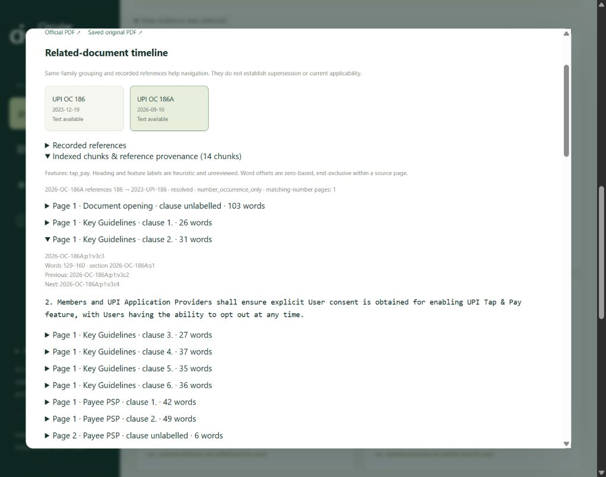

# Validation record — v0.3

Validated on 2026-09-24, Windows, Python 3.12.14, Chroma 1.5.9, local Ollama with Qwen3.5:9b and Qwen3-embedding:0.6b. This is implementation validation on developer-authored examples, not a held-out business/compliance accuracy claim.

## Automated checks

`run.cmd test`: **35 tests passed**. Includes the original 14 regression checks and 21 additional checks covering:

- Every source word retained, exact page-word spans, <=220 words/chunk, deterministic IDs and no cross-document neighbor links.
- Recognized headings with their first clause, cross-page section continuity and 35-word long-block overlap.
- Multiple feature labels, explicit circular selection, direct-only scope, reference attribution and distinct citation IDs.
- Date/product/feature filters throughout expansion; missing sources and malformed/nonexistent circular IDs cannot borrow neighboring requirements.
- Context budget, invalid controls, missing-reference warnings and provenance in generation prompts.
- Ambiguous reference resolution; SQLite roundtrip, foreign-key checks and integrity check.
- Real Chroma cosine search, metadata filtering, persistence/reopening and fingerprint/model isolation.
- Invalid vectors/dimensions, incomplete collections, corrupt manifests, and failed creation/upsert preserving the prior published snapshot.
- Existing provider, fabricated-citation, truncation and abstention contracts.

The tests use actual Chroma with temporary data, but mock model calls where needed. They do not require Ollama. JavaScript syntax check passed; `pip check` found no broken requirements.

## Migration parity

428 legacy JSON vectors were copied into Chroma with no re-embedding. The comparison used identical cached question vectors on both sides, 12 cases, vector and hybrid modes, top six chunk IDs. **24/24 ranking sequences matched**. This supports parity for these examples, not an assertion that approximate HNSW equals exhaustive cosine search for every possible question.

## New corpus audit

| Item | Result |
|---|---:|
| Register entries | 129 |
| Converted documents | 107 |
| Source pages | 251 |
| Clause-aware chunks/vectors | 916 |
| Words per chunk: min / median / max | 3 / 44 / 220 |
| Embedding dimensions | 1024 |
| Reference edges | 54 |
| Resolved / missing / text unavailable | 32 / 21 / 1 |
| Title-derived feature categories | 8 |
| Availability gaps / priority-review pages | 22 / 25 |

Full fingerprints, model digest, ranked IDs, sources and generated claims are in [raw results](../evaluation/v03_results.json).

## Retrieval smoke evaluation

| Method | Cases passing | Positive-case MRR | Expected-document recall |
|---|---:|---:|---:|
| BM25 | 12/12 | 1.00 | 1.00 |
| Vector | 11/12 | 1.00 | 1.00 |
| Hybrid | 11/12 | 1.00 | 1.00 |

The failed vector/hybrid case is `quantum photosynthesis chlorophyll`: semantic search returns neighbors despite the topic being unrelated. Generation abstained in the separate live test. There is no calibrated vector similarity cutoff. MRR/recall exclude empty-target cases; overall pass rate includes them. These short, often title-like or exact-ID queries are optimistic smoke tests, not independent evaluation.

## Six live answers

| Question/check | Observed behavior |
|---|---|
| OC 186A consent | Three claims about enablement consent, device-binding consent and opt-out, with supporting excerpts. |
| Compare OC 186 and 186A initiation | Three claims on NFC/QR introduction, PoS extension and unlocked-device tapping. |
| OC 201 primary/secondary users, strict scope | Two claims with cited delegation definitions. |
| OC 999 | No evidence; no generation request. |
| Quantum photosynthesis | Model abstained despite semantic neighbors. |
| OC 186 with 2024-01-01 cutoff | Three claims; only eligible earlier sources, with no 2026 circular. |

All six requests completed without errors. The 11 generated claims were manually checked against their saved cited excerpts and were supported at the excerpt level. This does not independently validate source OCR or legal interpretation. The comparison answer used OC 186A's own retrospective description of OC 186; it is not proof of exhaustive cross-document synthesis. Live results varied in latency; final run ranged from roughly 1.7 to 8.6 seconds for model requests, with the no-evidence response immediate. Hardware/loading state affects timings.

## Browser checks

- In-app browser: v0.3 loaded, hybrid/AI defaults enabled; a live consent answer showed OC 186A direct evidence and separately attributed OC 186 reference context.
- Direct-only scope produced six OC 186A excerpts with no expanded sources.
- Combined UPI + Tap & Pay feature + 2024-01-01 cutoff produced only eligible OC 186 excerpts.
- Reader exposed all 14 OC 186A chunks, reference provenance, and consent-clause offsets 129–160.
- A long-line overflow in the new reader was fixed. Chrome verification showed reader scroll width equal to client width (916 px).
- Chrome exported `circular-research-notes (1).md` to Downloads; the saved file was inspected for scope, fingerprint, circular/page IDs, inclusion reasons and chunk IDs. A copy is saved as [export example](../evaluation/v03_export_example.md).
- The in-app browser download event timed out; use Chrome for the validated download path. Mobile viewport behavior was not separately validated in this release.



## Reproduce

```powershell
.\run.cmd test
.\run.cmd validate
```

The live script overwrites `evaluation/v03_results.json`; keep a copy if comparing runs. It exits nonzero on provider exceptions. Inspect its raw results for ranking/answer regressions; it does not automatically grade factual correctness. Migration configuration and both indexes must exist.

## Remaining evaluation work

Author 40–60 independent, held-out questions with expert-reviewed supporting pages and expected answers. Include cross-circular changes, absent documents, numbers/tables, role applicability and dates. Separately score retrieval recall, factuality, citation support, abstention and completion time against manual lookup. Validate feature/reference labels and OCR before claiming operational compliance accuracy.
