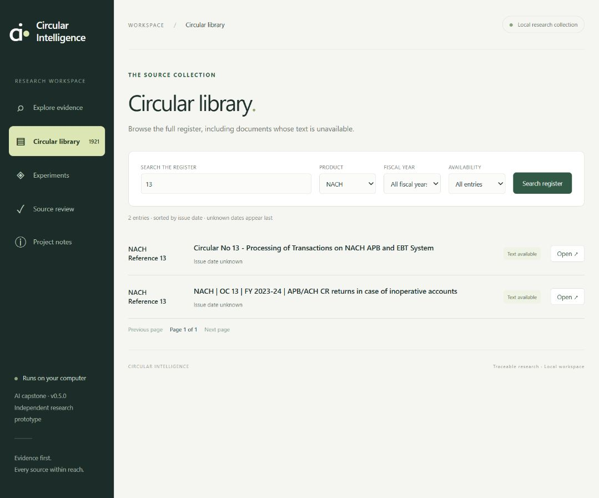
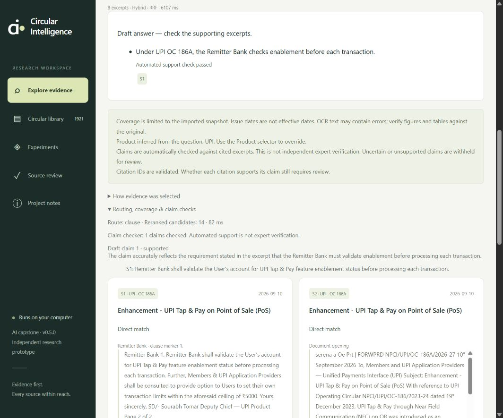

# v0.5 validation record

25 September 2026. Expanded corpus activated on localhost:8765 after these checks. These are development checks, not a guarantee of zero defects or independently measured answer accuracy.

## Results

| Check | Observed result |
|---|---|
| Automated suite after activation | **93 tests passed** in 5.448 seconds. |
| Input preservation | All 1,955 inventory listings retained; 1,631 copied Markdown/inventory files hash-verified. |
| Original corpus regression | All 916 existing chunk IDs/texts and original review records preserved. |
| Storage | SQLite integrity and foreign-key checks passed; 14,060 Chroma vectors ready. |
| Frozen UPI evaluation | BM25 + reranker **55/55** expected anchors; hybrid + reranker **55/55**. Explicit UPI filter used in the expanded corpus. |
| Product isolation | Explicit-ID and broad-query membership checks passed for all 12 imported product groups. |
| Live generation | Seven product cases generated 13 claims that passed the automated support checks; two negative cases abstained before generation. |
| Browser | Pagination, filters, exact selection, same-number comparison, partial coverage, source reader and generated answer exercised. No captured console warnings/errors in final session. |
| JavaScript | `node --check web/app.js` passed. |

`reports/v05_unit_tests.txt`, `reports/v05_validation.json`, and `reports/v05_live_answers.json` are the detailed evidence. The frozen dataset checksum is unchanged. Source-anchor recall checks whether expected quoted material was retrieved; it does not score generated answers or legal applicability. Product isolation cases are deliberately title-derived/source-selected smoke checks, not independently authored business questions.

## Live product cases

| Product | Selected subject | Retained claims | End-to-end engine time |
|---|---|---:|---:|
| AePS | BC Agent/CSP details in online transactions | 1 | 5.15 s |
| CTS | Northern Grid uniform holiday list | 2 | 9.54 s |
| IMPS | Best practices | 3 | 13.71 s |
| NACH | Revised NACH CECS Credit clearing timelines | 1 | 5.70 s |
| NETC | Enhancements in NRCS reports | 1 | 5.01 s |
| RuPay | Linked RuPay Credit Card on UPI transaction limit | 1 | 7.25 s |
| UPI | BHIM UPI brand-guidelines addendum | 4 | 14.52 s |

The prompt asked for one concise instruction. Several outputs supplied more than one claim or included a date despite the brevity request. This is a known response-control limitation, not evidence that the model follows every instruction. OCR spelling is also visible in the UPI draft. The answer checker uses the same Qwen model as generation; “automated supported” is not expert verification.

During an earlier smoke selection, an IMPS numeric claim was withheld by the numeric guard. That conservative behavior may suppress a plausible claim when digits and written-number wording differ. The final saved suite selects product-specific subjects and should not be interpreted as an independent seven-case accuracy benchmark.

## Browser evidence

The final server reported v0.5.0, the all-products-v1 directory, 1,921 register records, 1,562 searchable documents, 4,826 pages, 14,060 chunks and vector Ready.

The library showed 50 rows on page 1 of 39 and moved to page 2. Availability values were unique and fiscal-year options no longer contained the invalid literal “unknown.” Selecting two NACH reference-13 records produced 22 excerpts: 7/7 chunks from one and 15/47 from the other, with incomplete/unverified coverage clearly labelled. The AePS 33 reader retained blank page 1 and showed the missing-text warning. Ambiguous OC 13 requests showed choices without creating an answer.

A final browser question, “Under UPI OC 186A, who checks enablement before each transaction?”, produced one cited claim naming the Remitter Bank, supported by the displayed quoted requirement. This request took 6.107 seconds and reranked 14 candidates in 82 ms. These timings are individual observations, not a performance benchmark.

## Fixes found during implementation

- Imported Unicode line separators no longer break JSONL parsing.
- Empty extracted pages remain visible but cannot create empty embeddings or false full-source coverage.
- Product membership filtering includes shared circulars while canonical ownership remains stable.
- Ambiguous/unavailable repeated references cannot silently resolve to another product or year.
- The source reader distinguishes external originals from saved local PDFs.
- Dynamic availability controls no longer duplicate Cancelled/Download failed options.
- Invalid “unknown” fiscal-year values are excluded from selectable year filters.
- Activation rejects failed/stale validation, incomplete vectors and a changed embedding-model digest.
- Historical tests use their preserved dataset explicitly after the active configuration changes.

## Source-quality limits and next research work

359 register records are not searchable, including two quarantined metadata/body conflicts. Some available Markdown is partial or noisy. Most new issue dates and extracted metadata are unverified; original PDFs were absent from the supplied folder. No new complete PDF/OCR audit, live website reconciliation, automatic supersession graph or expert answer review has been performed.

The next capstone milestone is independent, product-balanced answer evaluation with reviewed citations and negative cases, followed by targeted source repair and metadata review. Full code rollback was preserved but not exercised over the active working tree; data/config activation and compatibility with the old corpus were tested.
