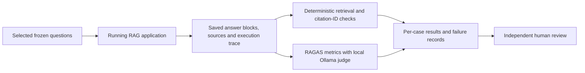

# RAGAS evaluation of Payments Guidelines Query Expert

This is an offline evaluation companion to the application. It captures real generated answers and scores saved answers using **RAGAS 0.4.3 and a local Ollama judge**. It does not add a model call to normal user queries or alter the frozen 50-question benchmark.

The implementation and initial pilot are provisional developer evidence. Human-reviewed references, judge calibration and a genuinely held-out dataset remain pending. See the [initial 50-question catalogue](INITIAL_50_QUESTIONS.md) for the original questions and their limitations.

**Completed pilot:** [12-case results, findings and validation](ragas_runs/README.md). All 12 application calls completed; 44 applicable metric scores succeeded. The low draft-reference correctness scores are retained and explained, not presented as validated answer accuracy.

## Evaluation flow



Capture and scoring are separate. A saved capture can be scored again without regenerating the application answers. Every new scoring run has its own directory. Interrupted scoring can resume with identical capture, model, package versions, code and settings. Completed scores are reused; failed attempts are retained when retried. Capture writes after every case but does not currently resume an interrupted capture; preserve it and start a new capture of the outstanding IDs.

## What is measured

| Check | Inputs and interpretation | Limits |
|---|---|---|
| Source anchors | Document ID, page and anchor quote in returned sources | Selected anchors are not complete evidence coverage |
| Citation ID validity | Every displayed claim cites existing returned source IDs | Does not establish that the sources support the claim |
| Faithfulness | RAGAS checks answer claims against all supplied evidence | Can score an incomplete answer highly |
| Factual correctness | RAGAS compares response and draft reference claims | Short or incomplete references can give misleading results; not validated answer accuracy |
| Context recall | RAGAS checks whether evidence supports reference-answer claims | Different from our exact source-anchor recall |
| Context precision | RAGAS checks the ordering of useful evidence against the reference | Sensitive to the reference and judge; extra model calls per context |
| Citation support | Custom aggregation of RAGAS faithfulness per displayed claim, using only that claim's cited sources | Model judgement, not independent verification; equal weighting of displayed claims |
| Abstention | Application abstention flag versus draft expected behaviour | Report positive refusals and negative refusals separately; errors are not successful refusals |
| Latency and errors | Capture wall time, app trace and scoring time | Judge latency is separate from user-facing answer latency |

The default metrics are faithfulness, factual correctness and context recall. Context precision and citation support are opt-in because they add calls. Negative cases are excluded from answer-metric averages and counted explicitly. Abstained positive answers are excluded from answer metrics and disclosed as positive refusals. Summary/comparison cases retain faithfulness and citation checks but skip reference-based metrics: their original references are generic rubrics, not complete answers. No single overall accuracy score is calculated.

## Implementation choices

- The adapter scores `answer_blocks` in displayed order, with `claims` as a legacy fallback. It refuses to treat the API's success banner as a substantive answer.
- Context includes the evidence text and metadata supplied by the current app, retaining document/page identity and dates. Full raw responses remain in `capture.json`. This is the app-selected evidence, not an independently reconstructed set of all relevant pages.
- A native Ollama adapter implements RAGAS's `InstructorBaseRagasLLM`. RAGAS owns the metric prompts and calculations; Ollama returns schema-constrained JSON. This adapter lets us explicitly set `think=false`, temperature 0, a 16,384-token context and a 4,096-token output cap without changing the application's model configuration.
- Each judge request, output, reasoning returned in JSON, timing and failure is saved in `judge_calls.jsonl`. Token-limit and schema failures become evaluator errors, not numeric zeroes. The runner does not intentionally trim evidence to improve scores; Ollama context limits still require attention on larger cases.
- Only local HTTP endpoints are accepted. RAGAS usage telemetry is disabled before import. Package installation needs internet access; score execution uses the installed local judge and does not use a cloud API key.
- The application environment is untouched. Evaluation has a separate `.venv-eval` and dependency lock. `langchain-community==0.3.31` is pinned because the newer community package removed a legacy wrapper still imported by RAGAS 0.4.3.
- Records include dataset/configuration hashes, corpus fingerprints, application revision, model digests, scorer version and scoring-code hashes. A changed corpus during capture blocks scoring. Saved run directories are evidence; do not edit them to improve results.

## Running it on Windows

Use Python 3.12. Start Ollama and the app with the project's normal setup. The app must be reachable at `http://127.0.0.1:8765`. Then, from the project folder:

```text
setup-eval.cmd
run-eval.cmd capture
```

Capture defaults to the 12 cases listed below and prints an output directory such as `evaluation\ragas_runs\20261004T120000Z`. Use that actual directory in the scoring command:

```text
run-eval.cmd score evaluation\ragas_runs\20261004T120000Z\capture.json
```

For all five supported checks:

```text
run-eval.cmd score evaluation\ragas_runs\20261004T120000Z\capture.json --metrics faithfulness,factual_correctness,context_recall,context_precision,citation_support
```

Select questions or retrieval variants explicitly:

```text
run-eval.cmd capture --ids RAG-001,RAG-006,RAG-045,RAG-048
run-eval.cmd capture --all --method bm25 --no-rerank
run-eval.cmd capture --all --method vector --no-rerank
run-eval.cmd capture --all --method hybrid --no-rerank
run-eval.cmd capture --all --method hybrid --rerank
```

The last four commands each make a separate full application run; they are not needed for a first check. Keep generation and context settings fixed when comparing them. Summary/comparison routes bypass reranking and must be analysed separately.

To resume an interrupted scoring run, use the same options and add `--resume` with its existing `scores-...` directory. Changing a metric list, judge, token limits, capture or scoring code requires a new run. If all scores are already complete, resume makes no additional judge requests.

`--judge-model` selects another model already installed in Ollama. The default is `qwen3.5:9b`, also our generator. This avoids another download for integration testing but does not give independent validation. A different model still needs calibration against human judgements. No alternative judge has been benchmarked here.

## Pilot coverage

The default pilot comprises RAG-001, 006, 008, 017, 024, 028, 030, 032, 033, 039, 045 and 048: eight focused questions, one summary, one comparison and two negative cases. It exercises multiple modules; it is not a statistically representative sample of payments research. It does not exercise every ambiguity or missing-page scenario.

The initial four-case integration run is saved under [local pilot](ragas_runs/local-pilot-20261004/capture.json). Its two generated answers received faithfulness 1.0, but factual correctness 0.0 against the old terse references. The judge logs show that “P2M only.” and “Account feature-enablement status.” omit the subjects and conditions present in the full answers. This exposes a reference-quality problem and a limitation of context-free answer comparison; it does not by itself establish that the app's answers were wrong. Both negative cases abstained, including the unrelated question that had retrieved irrelevant sources. Keep these observations when improving the reference set.

## Files and human review

Each capture directory contains `capture.json` and a prefilled `human_review.csv`. Each scoring directory contains `scores.json`, `SUMMARY.md` and `judge_calls.jsonl`. Summary tables show scored, skipped, failed and pending counts. Means use successful eligible scores only; consult the denominator before comparing runs.

Team reviewers should independently inspect complete source passages, check actual answers and citations, and record missing conditions. Adjudicate disagreements and create complete reference answers in a new dataset version. The original 50-question JSON must retain its checksum. Synthetic controls can check whether the judge reacts to obvious errors, but cannot replace human calibration. Until then, label all automated scores provisional and keep the submission's existing retrieval results distinct from this newer pilot.

The optional sanity check can be rerun with `.venv-eval\Scripts\python.exe evaluation\check_ragas_judge.py`. Its policy is explicitly fictional; its records are stored separately from application runs.

## References

- [RAGAS faithfulness](https://docs.ragas.io/en/stable/concepts/metrics/available_metrics/faithfulness/)
- [RAGAS factual correctness](https://docs.ragas.io/en/stable/concepts/metrics/available_metrics/factual_correctness/)
- [RAGAS context recall](https://docs.ragas.io/en/stable/concepts/metrics/available_metrics/context_recall/)
- [RAGAS context precision](https://docs.ragas.io/en/stable/concepts/metrics/available_metrics/context_precision/)

Current metrics use the collections API in the pinned package. Example commands and outcomes above were checked against this repository; they do not claim independent evaluation or production readiness.
